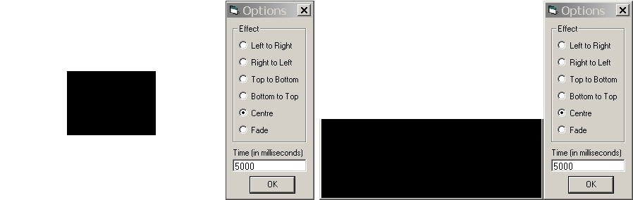



## Animated Window

### Description

Add special effect to your form when it is showing and hiding! 6 types of effects can be applied. They are roll left to right, roll right to left, roll top to bottom, roll bottom to top, expand window outward and fade window. This program shows how to add these fancy effects. Make sure you have Windows 2000 and later or Windows 98 and later running before running this program. The program is well commented and a tutorial is included. Your comments and votes is the way you repay me for my work.
 
### More Info
 

             |
---                |---
**Submitted On**   |2003-11-09 22:03:26
**By**             |[Lam Ri Hui](https://github.com/Planet-Source-Code/PSCIndex/blob/master/ByAuthor/lam-ri-hui.md)
**Level**          |Intermediate
**User Rating**    |5.0 (25 globes from 5 users)
**Compatibility**  |VB 5\.0, VB 6\.0
**Category**       |[Windows API Call/ Explanation](https://github.com/Planet-Source-Code/PSCIndex/blob/master/ByCategory/windows-api-call-explanation__1-39.md)
**World**          |[Visual Basic](https://github.com/Planet-Source-Code/PSCIndex/blob/master/ByWorld/visual-basic.md)
**Archive File**   |[Animated\_W16701911102003\.zip](https://github.com/Planet-Source-Code/lam-ri-hui-animated-window__1-49792/archive/master.zip)

